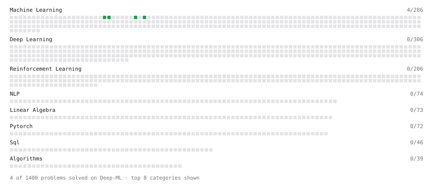

# Deep-ML

My machine learning practice from [Deep-ML](https://www.deep-ml.com). Every solution here was written by hand.

**6** solved · 5 problems · 1 labs · 0 math

[**Browse the interactive portfolio**](https://omgomji.github.io/deep-ml/) to replay this filling in over time.

## Problems

| | Difficulty | Solved | |
| --- | --- | --- | --- |
| [Detect Overfitting or Underfitting](https://www.deep-ml.com/problems/86) | easy | 2026-09-16 | [solution](problems/0086-detect-overfitting-or-underfitting) |
| [Generate a Confusion Matrix for Binary Classification](https://www.deep-ml.com/problems/75) | easy | 2026-09-16 | [solution](problems/0075-generate-a-confusion-matrix-for-binary-classification) |
| [Implement F-Score Calculation for Binary Classification](https://www.deep-ml.com/problems/61) | easy | 2026-09-16 | [solution](problems/0061-implement-f-score-calculation-for-binary-classification) |
| [Implement Recall Metric in Binary Classification](https://www.deep-ml.com/problems/52) | easy | 2026-09-16 | [solution](problems/0052-implement-recall-metric-in-binary-classification) |
| [Precision and Recall at Threshold](https://www.deep-ml.com/problems/849) | medium | 2026-09-16 | [solution](problems/0849-precision-and-recall-at-threshold) |

## Labs

| | Difficulty | Solved | |
| --- | --- | --- | --- |
| [Implement Train/Val/Test Split and Evaluate a Baseline](https://www.deep-ml.com/labs/3d26c3f9-cb73-4ab1-bc4d-86cfab2af6d1) | easy | 2026-09-16 | [solution](labs/3d26c3f9-cb73-4ab1-bc4d-86cfab2af6d1-implement-train-val-test-split-and-evaluate-a-baseline) |

---

_This file is regenerated by Deep-ML on every push._
